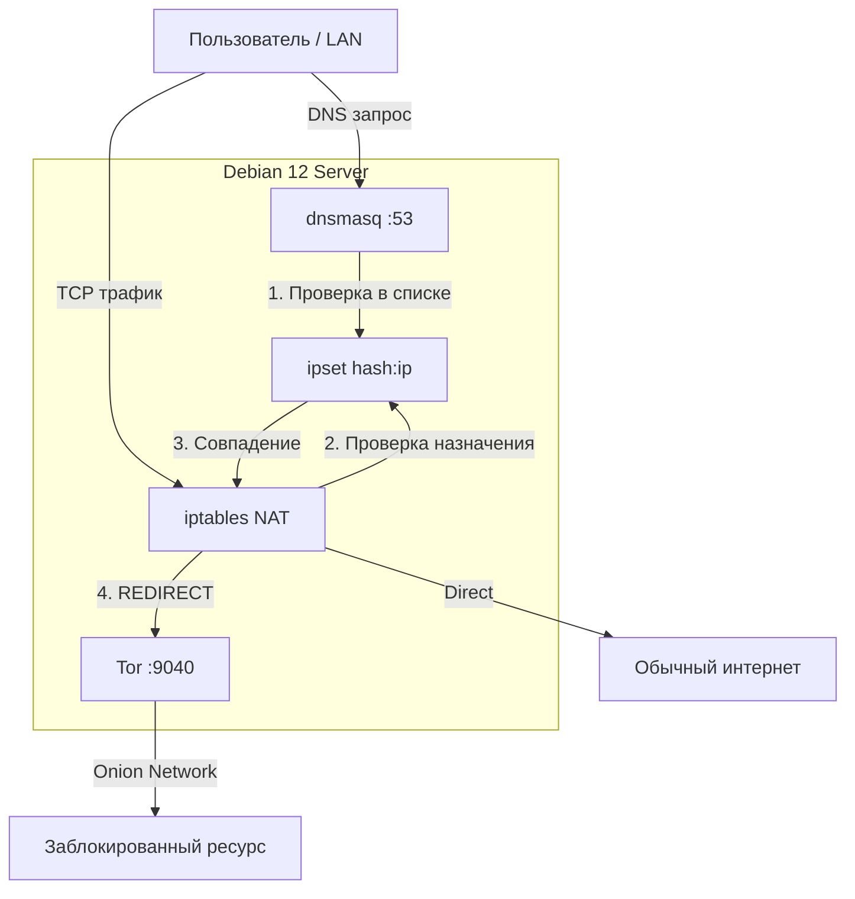

# 🛡️ rublock-tor-debian12

<div align="center">

**Автоматический обход блокировок через Tor. Разработано специально для Debian 12 (Bookworm).**

Система прозрачно маршрутизирует трафик к заблокированным ресурсам через сеть Tor, сохраняя прямое соединение и максимальную скорость для обычных сайтов.

[](https://www.debian.org/)
[](https://www.torproject.org/)
[](https://opensource.org/licenses/MIT)

</div>

---

## 📋 Содержание

- [✨ Особенности](#-возможности)
- [🏗 Архитектура решения](#-архитектура)
- [📦 Требования](#-требования)
- [⚡ Быстрая установка](#-быстрая-установка)
- [🎯 Использование](#-использование)
- [⚙️ Настройка и Кастомизация](#-настройка)
- [📊 Источники блокировок](#-источники-списков)
- [🛠 Управление и Диагностика](#-управление)
- [🤝 Поддержка проекта](#-поддержка-проекта)

---

## ✨ Возможности

- 🚀 **Высокая производительность**: Обычный трафик (YouTube, игры, загрузки) идет напрямую без замедления. Через Tor проходят только заблокированные ресурсы.
- 🔄 **Мульти-источник**: Агрегация списков из `antifilter`, `zapret-info`, `antizapret` и `rublacklist`.
- 🤖 **Полная автоматизация**: Ежедневное обновление списков через `systemd timer`.
- 🛡️ **Умная фильтрация**: 
  - Дедупликация записей (~1.2 млн → оптимизированный набор).
  - Поддержка CIDR подсетей в `ipset` (экономия памяти).
  - Группировка поддоменов.
- 📝 **Гибкость**: Легкое добавление своих доменов и IP через `custom.list`.
- 🏠 **Сетевой шлюз**: Работает как DNS-сервер для всей локальной сети (Smart TV, телефоны, консоли).
- 🌐 **IPv6 Ready**: Полная поддержка современного стека протоколов.

---

## 🏗 Архитектура

Система использует связку классических инструментов Linux для максимальной надежности:



---

## 📦 Требования

> [!IMPORTANT]
> Скрипты оптимизированы и протестированы исключительно на **Debian 12 (Bookworm)**.

| Ресурс | Минимум | Рекомендуется |
|:---|:---|:---|
| **CPU** | 1 Core (любой арх.) | 2 Cores |
| **RAM** | 512 MB | 1 GB |
| **Disk** | 200 MB | 1 GB |
| **Сеть** | Доступ в интернет | Статический IP в LAN |

---

## ⚡ Быстрая установка

Зайдите на сервер под `root` и выполните следующие команды:

```bash
# 1. Подготовка системы и клонирование
sudo apt update && sudo apt install -y git
git clone https://github.com/grashooper/rublock-tor-debian12.git
cd rublock-tor-debian12/debian

# 2. Запуск автоматического установщика
sudo ./install_debian12.sh
```

**Установщик автоматически:**
1. Определит ваш локальный IP.
2. Установит `tor`, `dnsmasq`, `ipset`, `lua5.4` и зависимости.
3. Сгенерирует конфиги.
4. Скачает базы блокировок и запустит сервисы.

---

## 🎯 Использование

### 1. Настройка клиентов (Телефоны, ПК, TV)

Самый простой способ — изменить DNS на устройстве.

* **IP сервера**: Тот, который определил скрипт (например, `192.168.1.10`).
* **Настройка**: Укажите этот IP как **единственный DNS-сервер** в настройках Wi-Fi или сетевой карты.

### 2. SOCKS5 Прокси

Если вам нужен прокси для Telegram или браузера:
* **IP**: IP вашего сервера
* **Port**: `9050`

### 3. Проверка работы

На сервере:
```bash
# Проверка через Tor (должен показать IP выходной ноды Tor)
curl --socks5 127.0.0.1:9050 https://check.torproject.org/api/ip

# Проверка доступа к заблокированному ресурсу
curl -I https://rutube.ru
```

---

## ⚙️ Настройка

### Добавление своих сайтов (`custom.list`)

Файл создается автоматически. В нем можно использовать комментарии и CIDR-подсети.

```bash
sudo nano /etc/rublock/custom.list
```

**Пример заполнения:**
```text
# --- Домены ---
instagram.com
googlevideo.com

# --- IP адреса ---
1.1.1.1

# --- Подсети ---
203.0.113.0/24
```

После изменений примените их:
```bash
sudo rublock-update.sh
```

### Выбор источников списков

Редактируйте `/usr/local/lib/rublock/rublupdate.lua`:

```lua
local config = {
    sources = {
        antifilter = true,   -- Рекомендуется (Быстро)
        zapretinfo = true,   -- Рекомендуется (Официальный реестр)
        antizapret = true,   -- Опционально (Медленный API)
        rublacklist = false, -- Опционально (Часто недоступен)
    },
    -- ...
}
```

---

## 📊 Источники списков

Скрипт версии **3.3** использует интеллектуальное объединение:

1. **Antifilter**: Основной источник. Быстрый и чистый.
2. **Zapret-Info**: Полная выгрузка реестра (GitHub архив).
3. **Кэширование**: Если источник недоступен, скрипт использует сохраненную локальную копию (Graceful degradation).

---

## 🛠 Управление

| Действие | Команда |
|:---|:---|
| **Обновить списки вручную** | `sudo rublock-update.sh` |
| **Проверить статус Tor** | `systemctl status tor` |
| **Проверить статус DNS** | `systemctl status dnsmasq` |
| **Посмотреть таймер** | `systemctl list-timers rublock-update.timer` |
| **Логи обновления** | `journalctl -u rublock-update.service -n 50` |

---

## 🔒 Безопасность

* 🛡️ **Firewall**: Рекомендуется настроить `ufw` или `iptables`, разрешив доступ к портам 53 (UDP/TCP) и 9050 (TCP) **только** из вашей локальной сети (например, `192.168.0.0/16`).
* 🔄 **Updates**: Регулярно обновляйте систему (`apt update && apt upgrade`).

---

## 🤝 Поддержка проекта

Разработка и поддержка скриптов требуют времени. Если это решение помогло вам вернуть свободный интернет, вы можете поддержать автора:

<div align="center">

### `USDT (TRC20)`
```text
TCyZuUjX3ymFmrDPxTmeSNPMuuWRDtviFy
```

</div>

---

## 📄 Лицензия

MIT License. Свободное ПО для свободных людей.

**Copyright (c) 2025 rublock-tor-debian12**
