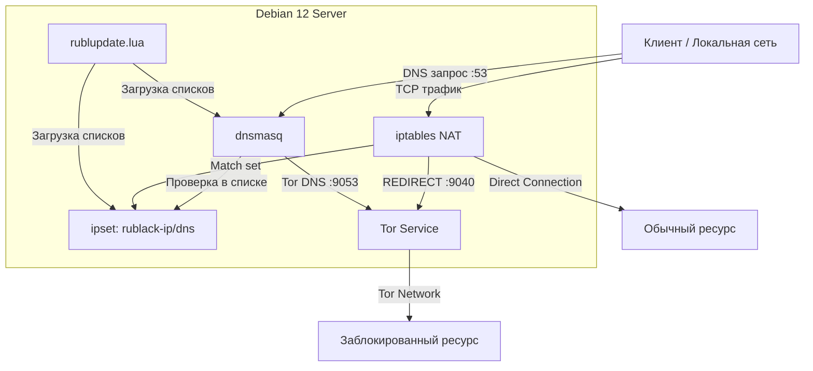

# rublock-tor-debian12

**Автоматический обход блокировок через Tor на Debian 12**

Система автоматически перенаправляет трафик к заблокированным ресурсам через Tor, используя агрегированные списки блокировок из нескольких источников. Обычный трафик идёт напрямую, без замедления и использования VPN.

[](https://opensource.org/licenses/MIT)
[](https://www.debian.org/)
[](https://www.torproject.org/)

## 📋 Содержание

- [🚀 Возможности](#-возможности)
- [🏗 Архитектура](#-архитектура)
- [📦 Требования](#-требования)
- [⚡ Быстрая установка](#-быстрая-установка)
- [🎯 Использование](#-использование)
- [⚙️ Настройка](#-настройка)
- [🔧 Управление](#-управление)
- [📊 Источники списков](#-источники-списков)
- [🐛 Устранение неполадок](#-устранение-неполадок)
- [❓ FAQ](#-faq)
- [🔒 Безопасность](#-безопасность)
- [📄 Лицензия](#-лицензия)

## 🚀 Возможности

- ✅ **Масштабный обход**: ~1.2 млн заблокированных доменов и IP (объединение баз).
- ✅ **Мульти-источник**: одновременная работа с Antifilter, Zapret-Info, Antizapret и RuBlacklist.
- ✅ **Умная маршрутизация**: обычный трафик идет напрямую, заблокированный — прозрачно через Tor.
- ✅ **Отказоустойчивость**: система кэширования и режим "Graceful degradation" — если источник недоступен, используется локальный кэш или данные других провайдеров.
- ✅ **Собственные списки**: поддержка `custom.list` для добавления своих доменов, IP и подсетей (CIDR) с удобным шаблоном.
- ✅ **Оптимизация**: группировка поддоменов и использование подсетей в ipset для экономии памяти.
- ✅ **Сетевой шлюз**: работает для всех устройств в локальной сети (по DNS или SOCKS5).
- ✅ **IPv6**: полная поддержка.

## 🏗 Архитектура



## 📦 Требования

### Системные требования
- **ОС**: Debian 12 (Bookworm) / Ubuntu 22.04+
- **RAM**: минимум 512 MB (рекомендуется 1 GB для полных списков)
- **CPU**: любой (x86/x64/ARM)
- **Сеть**: Стабильное соединение

### Зависимости
Устанавливаются автоматически скриптом: `tor`, `tor-geoipdb`, `obfs4proxy`, `dnsmasq`, `ipset`, `iptables-persistent`, `lua5.4`, `lua-socket`, `lua-sec`, `curl`.

## ⚡ Быстрая установка

1. **Клонируйте репозиторий:**
   ```bash
   git clone https://github.com/grashooper/rublock-tor-debian12.git
   cd rublock-tor-debian12/debian
   ```

2. **Запустите скрипт установки (от root):**
   ```bash
   sudo ./install_debian12.sh
   ```

3. **Следуйте инструкциям.** Скрипт автоматически:
   - Определит ваш локальный IP.
   - Установит пакеты.
   - Настроит конфиги Tor и dnsmasq.
   - Скачает списки и запустит службы.

## 🎯 Использование

### На сервере (локально)
```bash
# Проверка обхода (должен вернуть IP Tor-ноды)
curl --socks5 127.0.0.1:9050 https://check.torproject.org/api/ip

# Проверка резолвинга onion/заблокированных адресов
dig @127.0.0.1 -p 9053 facebookwkhpilnemxj7asaniu7vnjjbiltxjqhye3mhbshg7kx5tfyd.onion
```

### На устройствах в сети (Клиенты)

Чтобы устройства в вашей сети (телефоны, ноутбуки, TV) обходили блокировки, настройте их сетевое подключение:

**Вариант А: Прозрачно через DNS (Рекомендуется)**
Укажите IP-адрес вашего сервера (например, `192.168.1.10`) в качестве **DNS-сервера** на клиенте.
- *Windows*: Свойства адаптера -> IPv4 -> DNS.
- *Android/iOS*: Настройки Wi-Fi -> IP: Статический / DNS.
- *Роутер*: Можно прописать этот DNS в DHCP настройках роутера, чтобы раздавать всем автоматически.

**Вариант Б: SOCKS5 Прокси**
Используйте в Telegram, Firefox или других приложениях:
- IP: `IP_вашего_сервера`
- Порт: `9050`

## ⚙️ Настройка

### Добавление своих сайтов и IP
Файл `/etc/rublock/custom.list` создается автоматически.
```bash
sudo nano /etc/rublock/custom.list
```
Формат:
```text
# Домены
my-blocked-site.com
subdomain.example.org

# IP адреса
1.2.3.4

# Подсети (CIDR)
10.0.0.0/8
192.168.100.0/24
```
После редактирования запустите обновление: `sudo rublock-update.sh`

### Изменение источников списков
Редактируйте `/usr/local/lib/rublock/rublupdate.lua`:
```lua
local config = {
    sources = {
        antifilter = true,   -- Рекомендуется (быстро)
        antizapret = true,   -- Медленный API, но точно
        zapretinfo = true,   -- GitHub архив
        rublacklist = false, -- Часто недоступен
    },
    -- ...
}
```

### Настройка Tor (Мосты)
Если Tor заблокирован провайдером, раскомментируйте строки мостов в `/etc/tor/torrc`:
```conf
ClientTransportPlugin obfs4 exec /usr/bin/obfs4proxy
UseBridges 1
Bridge obfs4 <IP>:<PORT> <FINGERPRINT> cert=<CERT> iat-mode=0
```
Получить мосты можно в [Telegram боте](https://t.me/GetBridgesBot).

## 🔧 Управление

- **Ручное обновление списков:**
  ```bash
  sudo rublock-update.sh
  ```
- **Просмотр статуса служб:**
  ```bash
  systemctl status tor dnsmasq
  ```
- **Просмотр таймера автообновления:**
  ```bash
  systemctl list-timers rublock-update.timer
  ```
- **Просмотр статистики ipset:**
  ```bash
  sudo ipset list rublack-ip -t | head
  ```

## 📊 Источники списков

Скрипт версии 3.3 умеет объединять данные из нескольких источников, удаляя дубликаты:

1. **Antifilter**: Быстрые списки, обновляются часто. (Основной)
2. **Zapret-Info**: Официальный выгрузка реестра (GitHub архив).
3. **Antizapret**: API сервиса (может быть медленным при первичной загрузке).
4. **RuBlacklist**: Реестр Роскомсвободы (опционально).

**Кэширование:** Все успешные загрузки сохраняются в `/var/cache/rublock`. Если источник недоступен, скрипт автоматически использует последние удачные данные.

## 🐛 Устранение неполадок

**1. Tor не запускается?**
Проверьте логи: `journalctl -u tor -n 50`. Частая причина — блокировка Tor провайдером. Используйте мосты (bridge).

**2. Ошибка при обновлении списков?**
Запустите вручную и посмотрите вывод: `sudo rublock-update.sh`. Скрипт имеет цветной вывод и покажет, на каком этапе возникла ошибка.

**3. Не открываются сайты на клиенте?**
- Проверьте, что клиент использует DNS вашего сервера.
- Проверьте, что сервер пингуется с клиента.
- Проверьте firewall на сервере (должны быть открыты порты 53 UDP/TCP и 9050 TCP для локальной сети).

## ❓ FAQ

**В: Сильно ли это нагружает систему?**
О: Нет. Благодаря использованию `ipset` и группировке доменов, потребление RAM минимально (~150-250 МБ). Работает даже на Raspberry Pi Zero.

**В: Весь ли мой трафик идет через Tor?**
О: Нет. Через Tor идет только трафик к ресурсам из списков блокировки и вашего `custom.list`. YouTube, Госуслуги и прочее работают напрямую с полной скоростью.

**В: Как часто обновляются списки?**
О: По умолчанию — каждый день в 05:00 утра (настраивается в `rublock-update.timer`).

## 🔒 Безопасность

- Скрипт не открывает порты во внешний интернет, но рекомендуется настроить firewall (`ufw`), разрешив доступ к портам 53 и 9050 только из локальной сети (например, `192.168.0.0/16`).
- Регулярно обновляйте систему (`apt update && apt upgrade`).

## 📄 Лицензия

MIT License. Свободное использование и модификация.

---

**Разработано для свободного интернета.** 🕊️
```

